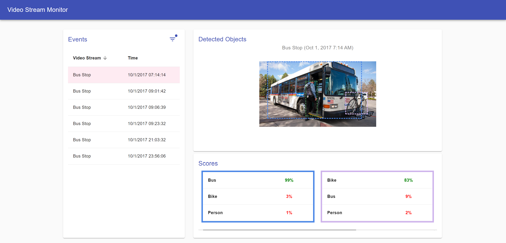

# Video Stream Event Monitoring
A web application to view the detected events of your video streams.



## **What's Next?**
How can we extend this project to become a real product? This may depend on the usage of the application.

### Scaling to handle more data
It's likely that there are many "events" detected on a video stream. If object detection occurs every second or so, long streams (like live streams) may detect millions of events. To handle this on the UI, the "Events" table should be virtualized and the fetched data should be paginated. Currently, sorting and filtering are completed in the backend in anticipation of table virtualization.

### Receiving new event updates
If the video streams are from live sources, there may be new events being detected as the user is using the application. There should be a strategy to load new images or notify users of updates.

### Improving the events timeline display
With potentially many events to display, the user may want to quickly preview each event. The "Events" table could be designed to include more information:
* Column to display a thumbnail preview of each event
* Column to preview detected people/objects (e.g. the top match)

### Adding video stream filtering
In the current design, it may seem natural to filter by video stream by using a dropdown menu in the filter popup. However, for use-cases where video streams may not be many (e.g. limited by hardware resources), it could make sense to display video streams in a [grid list](https://material-ui.com/components/grid-list/) to give a better preview of each video stream.

## **Immediate Improvements**

### Styling
One of the biggest improvements to make is in how we display the image. The image should scale to fit within the surrounding image "card". Currently, the image card gets bigger for larger images. 

The horizontal table displaying the scores for each prediction should be centered. Currently, for example, the "Vet Hospital" stream's sole prediction prediction is aligned left.

## **Technology Stack**
This project is written using React and TypeScript. It's a ```create-react-app``` project.

Notably, Material UI is used to style the application.

To support development, Visual Studio Code is the preferred IDE and ESlint and Prettier were used to enforce linting.

## **Project Structure**
The UI code is located in ```src```.

```index.tsx```
* Encapsulates all the UI code. Converts React components into DOM

```App.tsx```
* Outermost React component. 
* Defines a consistent look for all pages of the application (although, we only have one page). Renders the application-wide toolbar

```event-monitor/EventMonitor.tsx```
* The main component for our "video stream monitoring" web page. Defines the general layout of the page

```event-monitor/event-table/EventsTable.tsx```
* The table component on the left side of the web page. Users may select an event in this table
* Uses the ```EventsFilterDialog.tsx``` component to render the filter options popup

```event-monitor/event-details/EventDetails.tsx```
* The right side of the web page. Contains the details of the selected event
* ```AnnotatedImage.tsx``` is the component that display the image with annotated people/objects
* ```Predictions.tsx``` is the component that displays the predictions and scores for each annotated person/object

Other
* ```common``` contains common components that may be used application-wide. E.g. table, headings. These are not tied to one part of the application or business-logic
* ```api``` holds code that makes API calls to the backend server. These are all mocked
* ```utils``` utility functions

## **Development Notes**
### **Dependencies**
Operating system: Mac, Linux, Windows (WSL 2 only)

1. Install Node.js and ```npm```
2. Install UI dependencies

```bash
cd ui
npm install
```

### **Building and Running**

There are two ways to run the project: 

1. Run the application by opening ```index.html``` in the browser
2. Use ```npm start```

To build new changes to the html files, run the following:
```bash
cd ui
npm run build && npx gulp
cp -r build/* ../
```

### **IDE Setup**
We use Visual Studio Code (VS Code) for development.

Open the project root in VS Code.

Set up automatic linting in your IDE:

1. In the VS Code marketplace, install [ESLint](https://marketplace.visualstudio.com/items?itemName=dbaeumer.vscode-eslint) and [Prettier](https://marketplace.visualstudio.com/items?itemName=esbenp.prettier-vscode).

2. Make sure that the **Code Actions on Save** configuraiton in **Settings** is configured as such:
```js
"editor.codeActionsOnSave": {
    "source.fixAll.eslint": true // automatically fix basic lint after file save
},
...
"eslint.validate": [
    "typescript",
    "typescriptreact"
]
...
```